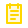

# Code of Conduct

Estándares de colaboración para mantener una comunidad profesional, segura y respetuosa.

[README](README.md) · [Contributing](CONTRIBUTING.md) · [Security](SECURITY.md)

---

##  Nuestro Compromiso

Nos comprometemos a hacer de la participación en UCB Hold una experiencia libre de acoso para todas las personas, sin distinción de edad, identidad o expresión de género, experiencia, educación, nacionalidad, apariencia, raza, religión, orientación sexual, discapacidad o condición socioeconómica.

---

##  Estándares

Comportamientos esperados:

| Esperado                               | No aceptado                                          |
| -------------------------------------- | ---------------------------------------------------- |
| Usar lenguaje inclusivo y profesional. | Lenguaje sexualizado, insultos o ataques personales. |
| Respetar puntos de vista distintos.    | Acoso público o privado.                             |
| Aceptar crítica constructiva.          | Publicar información privada sin permiso.            |
| Priorizar lo mejor para el proyecto.   | Conductas inapropiadas en un entorno profesional.    |

---

##  Responsabilidades

Los mantenedores pueden aclarar estándares, moderar conversaciones, cerrar discusiones, rechazar contribuciones o aplicar restricciones temporales o permanentes cuando una conducta afecte negativamente al proyecto.

---

##  Alcance

Este código aplica en espacios del proyecto y cuando una persona representa públicamente a UCB Hold, por ejemplo en issues, pull requests, discusiones, documentación, demos o comunicación comunitaria.

---

##  Reportes y Aplicación

Los incidentes pueden reportarse a los mantenedores listados en el README. Para reportes sensibles, usar canales privados.

Consecuencias posibles:

| Nivel                 | Acción                                           |
| --------------------- | ------------------------------------------------ |
| Corrección            | Advertencia privada con explicación.             |
| Advertencia           | Restricciones temporales de interacción.         |
| Suspensión temporal   | Pausa de participación por un periodo definido.  |
| Suspensión permanente | Restricción indefinida de participación pública. |

---

##  Atribución

Este código se basa en Contributor Covenant 1.4: <https://www.contributor-covenant.org/version/1/4/code-of-conduct.html>.
