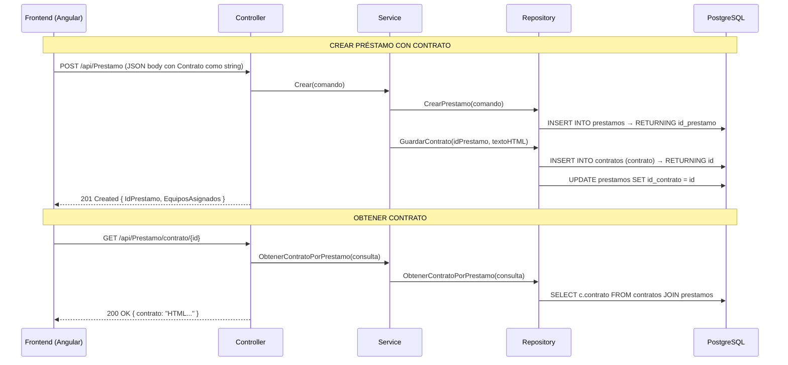

# Migración de Contratos: MongoDB → PostgreSQL

## Objetivo
Eliminar el uso de MongoDB (GridFS) para almacenar contratos y migrar todo a la tabla `public.contratos` en PostgreSQL. El contrato ahora se almacena como **texto (HTML)** en vez de como archivo binario.

---

## Resumen de Cambios

### Problema Anterior
- El contrato se enviaba como **archivo binario** (`IFormFile`) desde el frontend usando `FormData` (multipart/form-data)
- El backend lo guardaba en **MongoDB GridFS** (sistema de archivos distribuido de MongoDB)
- Para obtener el contrato, se buscaba en MongoDB y se devolvían los chunks binarios (`List<byte[]>`)

### Solución Implementada
- El contrato se envía como **texto (string)** en un JSON body
- Se almacena en la tabla PostgreSQL `public.contratos` (columnas: `id`, `contrato`)
- La tabla `prestamos` se vincula mediante `id_contrato` (FK → `contratos.id`, puede ser NULL)

---

## Archivos Modificados (Backend - Server)

### 1. `CrearPrestamoComando.cs`
**Ruta**: `src/Application/Request DTOs/Prestamo/CrearPrestamoComando.cs`

```diff
-using Microsoft.AspNetCore.Http;
-
 public record CrearPrestamoComando
 (
     int[]? GrupoEquipoId,
     DateTime? FechaPrestamoEsperada,
     DateTime? FechaDevolucionEsperada,
     string? Observacion,
     string? CarnetUsuario,
-    IFormFile? Contrato
+    string? Contrato
 );
```

> [!IMPORTANT]
> Se cambió `IFormFile?` (archivo binario) a `string?` (texto HTML del contrato). Ya no se necesita `Microsoft.AspNetCore.Http`.

---

### 2. `AceptarPrestamoComando.cs`
**Ruta**: `src/Application/Request DTOs/Prestamo/AceptarPrestamoComando.cs`

```diff
-using Microsoft.AspNetCore.Http;
-
 public record AceptarPrestamoComando
 {
     public int PrestamoId { get; set; }
-    public IFormFile Contrato { get; set; }
+    public string? Contrato { get; set; }
 }
```

---

### 3. `Contrato.cs` (Modelo)
**Ruta**: `src/Application/Request DTOs/Contrato/Contrato.cs`

**Antes**: Modelo MongoDB con atributos `[BsonId]`, `[BsonElement]`, etc.
**Después**: Modelo simple que representa la tabla PostgreSQL.

```csharp
namespace IMT_Reservas.Server.Infrastructure.Models
{
    public class ContratoEntidad
    {
        public int Id { get; set; }
        public string Contrato { get; set; } = null!;
    }
}
```

> [!NOTE]
> Se eliminaron todas las dependencias de `MongoDB.Bson` y `MongoDB.Bson.Serialization.Attributes`.

---

### 4. `IPrestamoRepository.cs` (Interfaz)
**Ruta**: `src/Infrastructure/Repositories/Interfaces/IPrestamoRepository.cs`

Cambios en las firmas de 3 métodos:

```diff
-    void GuardarContrato(int idPrestamo, IFormFile contrato);
+    void GuardarContrato(int idPrestamo, string contrato);

-    void ActualizarIdContrato(int prestamoId, string idContrato);
+    void ActualizarIdContrato(int prestamoId, int idContrato);

-    List<byte[]> ObtenerContratoPorPrestamo(ObtenerContratoPorPrestamoConsulta consulta);
+    string? ObtenerContratoPorPrestamo(ObtenerContratoPorPrestamoConsulta consulta);
```

Se eliminó `using Microsoft.AspNetCore.Http;`.

---

### 5. `PrestamoRepository.cs` (Implementación) ⭐ Cambio Principal
**Ruta**: `src/Infrastructure/Repositories/Implementations/PrestamoRepository.cs`

#### Dependencias eliminadas
```diff
-using IMT_Reservas.Server.Infrastructure.MongoDb;
-using MongoDB.Driver;
-using MongoDB.Driver.GridFS;
-using Microsoft.AspNetCore.Http;
```

#### Constructor simplificado
```diff
-    private readonly MongoDbContexto _mongoDbContext;
-    private readonly IGridFSBucket _gridFsBucket;
-
-    public PrestamoRepository(IExecuteQuery ejecutarConsulta, MongoDbContexto mongoDbContext, IGridFSBucket gridFsBucket)
+    public PrestamoRepository(IExecuteQuery ejecutarConsulta)
     {
         _ejecutarConsulta = ejecutarConsulta;
-        _mongoDbContext = mongoDbContext;
-        _gridFsBucket = gridFsBucket;
     }
```

#### `GuardarContrato` — Antes (MongoDB GridFS)
```csharp
public void GuardarContrato(int idPrestamo, IFormFile contrato)
{
    var fileName = contrato.FileName;
    using var stream = contrato.OpenReadStream();
    var fileId = _gridFsBucket.UploadFromStreamAsync(fileName, stream, null, default).GetAwaiter().GetResult();
    var contratoDoc = new Contrato { PrestamoId = idPrestamo, FileId = fileId.ToString() };
    _mongoDbContext.Contratos.InsertOneAsync(contratoDoc, null, default).GetAwaiter().GetResult();
    ActualizarIdContrato(idPrestamo, contratoDoc.FileId);
}
```

#### `GuardarContrato` — Después (PostgreSQL)
```csharp
public void GuardarContrato(int idPrestamo, string contrato)
{
    const string sqlInsertContrato = @"INSERT INTO public.contratos (contrato) VALUES (@contrato) RETURNING id";
    var parametrosContrato = new Dictionary<string, object?>
    {
        ["contrato"] = contrato
    };
    var dt = _ejecutarConsulta.EjecutarFuncion(sqlInsertContrato, parametrosContrato);
    var idContrato = Convert.ToInt32(dt.Rows[0][0]);
    ActualizarIdContrato(idPrestamo, idContrato);
}
```

> [!IMPORTANT]
> **Flujo**: Inserta el HTML en `contratos` → obtiene el `id` generado → actualiza `prestamos.id_contrato` con ese `id`.

#### `ActualizarIdContrato` — Cambio de tipo
```diff
-    public void ActualizarIdContrato(int prestamoId, string idContrato)
+    public void ActualizarIdContrato(int prestamoId, int idContrato)
```
El `id_contrato` ahora es un entero (serial de PostgreSQL) en vez de un ObjectId string de MongoDB.

#### `ObtenerContratoPorPrestamo` — Antes (MongoDB)
```csharp
public List<byte[]> ObtenerContratoPorPrestamo(ObtenerContratoPorPrestamoConsulta consulta)
{
    var contrato = _mongoDbContext.Contratos.Find(x => x.PrestamoId == consulta.PrestamoId && !x.EstadoEliminado).FirstOrDefault();
    var fileObjectId = MongoDB.Bson.ObjectId.Parse(contrato.FileId);
    var chunksCollection = _mongoDbContext.BaseDeDatos.GetCollection<MongoDB.Bson.BsonDocument>("fs.chunks");
    // ... lectura de chunks binarios ...
    return dataChunks;
}
```

#### `ObtenerContratoPorPrestamo` — Después (PostgreSQL)
```csharp
public string? ObtenerContratoPorPrestamo(ObtenerContratoPorPrestamoConsulta consulta)
{
    const string sql = @"SELECT c.contrato 
        FROM public.contratos AS c
        INNER JOIN public.prestamos AS p ON p.id_contrato = c.id
        WHERE p.id_prestamo = @prestamoId AND p.estado_eliminado = FALSE";
    var parametros = new Dictionary<string, object?>
    {
        ["prestamoId"] = consulta.PrestamoId
    };
    var dt = _ejecutarConsulta.EjecutarFuncion(sql, parametros);
    if (dt.Rows.Count == 0) return null;
    return dt.Rows[0]["contrato"]?.ToString();
}
```

---

### 6. `PrestamoService.cs`
**Ruta**: `src/Application/Services/Implementations/PrestamoService.cs`

```diff
-        if (comando.Contrato != null)
+        if (!string.IsNullOrWhiteSpace(comando.Contrato))
         {
             _prestamoRepository.GuardarContrato(idPrestamo, comando.Contrato);
         }

-    public List<byte[]> ObtenerContratoPorPrestamo(ObtenerContratoPorPrestamoConsulta consulta)
+    public string? ObtenerContratoPorPrestamo(ObtenerContratoPorPrestamoConsulta consulta)
```

---

### 7. `PrestamoController.cs`
**Ruta**: `src/Presentations/Controllers/PrestamoController.cs`

```diff
     [HttpPost]
-    public Result<PrestamoConEquiposDto?> Crear([FromForm] CrearPrestamoComando input)
+    public Result<PrestamoConEquiposDto?> Crear([FromBody] CrearPrestamoComando input)

     [HttpGet("contrato/{prestamoId}")]
-    public IActionResult ObtenerChunksContratoPorPrestamo(int prestamoId)
+    public IActionResult ObtenerContratoPorPrestamo(int prestamoId)
     {
         var consulta = new ObtenerContratoPorPrestamoConsulta(prestamoId);
-        var chunks = _servicio.ObtenerContratoPorPrestamo(consulta);
-        return Ok(chunks);
+        var contrato = _servicio.ObtenerContratoPorPrestamo(consulta);
+        if (contrato == null) return NotFound(new { mensaje = $"No se encontró contrato para el préstamo {prestamoId}" });
+        return Ok(new { contrato });
     }
```

> [!IMPORTANT]
> - `[FromForm]` → `[FromBody]`: Ya no se reciben archivos, se recibe JSON
> - El endpoint de contrato ahora retorna `{ contrato: "..." }` o `404 NotFound`

---

### 8. `MongoDbContexto.cs`
**Ruta**: `src/Infrastructure/MongoDb/MongoDbContexto.cs`

```diff
-using MongoDB.Driver.GridFS;

     public class MongoDbContexto
     {
         private readonly IMongoDatabase _baseDeDatos = null!;
-        private readonly GridFSBucket _gestionArchivos = null!;

         public MongoDbContexto(IOptions<MongoDbConfiguracion> configuracion)
         {
             MongoClient clienteMongo = new MongoClient(configuracion.Value.ConnectionString);
             _baseDeDatos = clienteMongo.GetDatabase(configuracion.Value.DatabaseName);
-            _gestionArchivos = new GridFSBucket(_baseDeDatos);
         }

         public virtual IMongoDatabase BaseDeDatos => _baseDeDatos;
-        public virtual IGridFSBucket GestionArchivos => _gestionArchivos;
-        public virtual IMongoCollection<Contrato> Contratos => _baseDeDatos.GetCollection<Contrato>("contratos");
```

> [!NOTE]
> MongoDB se mantiene para Comentarios y Notificaciones, solo se eliminó lo relacionado a contratos (GridFS + colección Contratos).

---

### 9. `CommandLineInterface.cs`
**Ruta**: `src/Presentations/CommandLineInterface.cs`

```diff
         // Se eliminó el registro de IGridFSBucket (ya no se necesita GridFS)
-        builder.Services.AddScoped<MongoDB.Driver.GridFS.IGridFSBucket>(sp =>
-        {
-            var mongoClient = sp.GetRequiredService<MongoDB.Driver.IMongoClient>();
-            var database = mongoClient.GetDatabase("UCB_Hold");
-            return new MongoDB.Driver.GridFS.GridFSBucket(database);
-        });
```

---

## Archivos Modificados (Frontend - Client)

### 10. `prestamos-api.service.ts`
**Ruta**: `Client/src/app/services/APIS/prestamo/prestamos-api.service.ts`

#### `crearPrestamo` — Antes (FormData/multipart)
```typescript
const formData = new FormData();
grupoid.forEach(id => formData.append('GrupoEquipoId', id.toString()));
formData.append('FechaPrestamoEsperada', ...);
// ...
return this.http.post(this.url, formData);
```

#### `crearPrestamo` — Después (JSON)
```typescript
const body = {
    GrupoEquipoId: grupoid,
    FechaPrestamoEsperada: carrito[grupoid[0]].fecha_inicio || null,
    FechaDevolucionEsperada: carrito[grupoid[0]].fecha_final || null,
    CarnetUsuario: carnet,
    Observacion: '',
    Contrato: contrato || null
};
return this.http.post(this.url, body);
```

#### `obtenercontratoPrestamo` — Antes (chunks binarios)
```typescript
return this.http.get<string[]>(APIurl).pipe(
    map(response => {
        const htmlContent = response[0] || '';
        const cleaned = htmlContent.replace(/undefined.../g, '');
        return cleaned;
    })
)
```

#### `obtenercontratoPrestamo` — Después (texto directo)
```typescript
return this.http.get<{ contrato: string }>(APIurl).pipe(
    map(response => {
        if (!response || !response.contrato) return '';
        return response.contrato;
    })
)
```

---

## Esquema de Base de Datos

### Tabla `public.contratos`
| Columna    | Tipo    | Descripción                          |
|------------|---------|--------------------------------------|
| `id`       | SERIAL  | PK, auto-incrementable              |
| `contrato` | TEXT    | Contenido HTML del contrato firmado  |

### Relación con `public.prestamos`
| Columna        | Tipo    | Descripción                                |
|----------------|---------|-------------------------------------------|
| `id_contrato`  | INTEGER | FK → `contratos.id`, puede ser **NULL**    |

```
prestamos.id_contrato ──→ contratos.id
```

---

## Flujo Completo (Después de la migración)


