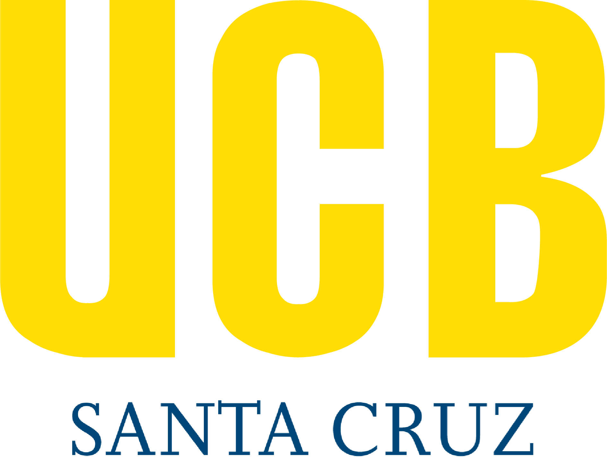

<div align="center">



# UCB Hold

Sistema web para reservar, aprobar, prestar y devolver equipos del Laboratorio de Mecatrónica de la Universidad Católica Boliviana.

<p>
  <a href="#inicio-rapido">Inicio rápido</a>
  ·
  <a href="#arquitectura">Arquitectura</a>
  ·
  <a href="Docs/API.md">API</a>
  ·
  <a href="Docs/DATABASE.md">Base de datos</a>
  ·
  <a href="CONTRIBUTING.md">Contribuir</a>
</p>

[](https://github.com/alejandroramirezvallejos/UCB_Hold/actions/workflows/tests.yml)
[](https://dotnet.microsoft.com/)
[](https://angular.dev/)
[](https://www.postgresql.org/)
[](https://redis.io/)
[](https://feature-sliced.design/)
[](https://www.docker.com/)

</div>

---

##  Producto

UCB Hold centraliza el flujo completo de préstamos de laboratorio: búsqueda de equipos, carrito de reserva, validación de disponibilidad, aprobación administrativa, contrato, entrega, devolución, mantenimiento e historial.

| Área           | Capacidades                                                                                   |
| -------------- | --------------------------------------------------------------------------------------------- |
| Inventario     | Equipos, grupos, gaveteros, muebles, accesorios, componentes y catálogos administrativos.     |
| Reservas       | Flujo `pendiente -> aprobado -> activo -> finalizado`, con rechazo y cancelación controlados. |
| Disponibilidad | Cálculo por rango de fechas; solo préstamos `aprobado` y `activo` bloquean capacidad.         |
| Auditoría      | Panel de observaciones y trazabilidad para acciones administrativas.                          |
| Contratos      | Generación de contrato HTML asociado al préstamo.                                             |
| Mantenimiento  | Registro preventivo/correctivo por empresa y detalle de equipos intervenidos.                 |
| Seguridad      | JWT, refresh token, guards, validación de formularios y sanitización de HTML sensible.        |

---

##  Stack

| Capa     | Tecnología                                                 | Uso                                                                             |
| -------- | ---------------------------------------------------------- | ------------------------------------------------------------------------------- |
| Frontend | Angular 19.2, TypeScript, RxJS, ts-results-es              | UI reactiva, guards, interceptors, cache HTTP y manejo explícito de resultados. |
| Backend  | ASP.NET Core 8, Ardalis.Result, FluentValidation, Mapperly | API REST, reglas de negocio, validación y contratos de respuesta.               |
| Datos    | PostgreSQL 14+, EF Core 8, Npgsql                          | Persistencia, índices, enums nativos y proyecciones optimizadas.                |
| Cache    | Redis 7                                                    | Soporte de infraestructura y rendimiento.                                       |
| Calidad  | Jasmine/Karma, NUnit, GitHub Actions, SonarQube            | Tests, cobertura HTML, reporte de calidad y pipeline CI.                        |
| Entrega  | Docker Compose, Nginx                                      | Ejecución local y despliegue full-stack.                                        |

---

##  Arquitectura

El frontend sigue Feature-Sliced Design y convenciones actuales de Angular:

| Capa                            | Responsabilidad                                               | Ejemplos                                               |
| ------------------------------- | ------------------------------------------------------------- | ------------------------------------------------------ |
| `app` / `providers` / `routing` | Configuración global, rutas, guards e interceptors.           | `app.config.ts`, `app.routes.ts`, `jwt.interceptor.ts` |
| `pages`                         | Pantallas enrutable completas.                                | `home`, `admin`, `cart`, `loan-history`                |
| `widgets`                       | Bloques grandes reutilizables compuestos.                     | `navigation`, `admin-sidebar`, `audit-panel`           |
| `features`                      | Casos de uso y acciones de negocio.                           | `admin-equipment`, `cart`, `availability-selector`     |
| `entities`                      | Modelos, servicios API y UI ligada a entidades.               | `loan`, `equipment-group`, `user`                      |
| `shared`                        | Utilidades, componentes base, directivas y tipos compartidos. | `custom-select`, `api-response`, `error-handler`       |

Los archivos del cliente usan `kebab-case`, una clase/interfaz principal por archivo cuando aplica, barriles `index.ts` por slice y nombres explícitos alineados con Angular.

---

##  Inicio Rápido

### Docker

Crear `Code/server.env`:

```ini
ASPNETCORE_ENVIRONMENT=Production
ASPNETCORE_URLS=http://+:80
ConnectionStrings__PostgreSQL=Host=ucb_db;Port=5432;Database=IMT_Reservas;Username=postgres;Password=postgres;Pooling=true;MinPoolSize=2;MaxPoolSize=20
Jwt__Key=<clave-local-de-32-caracteres-o-mas>
Redis__ConnectionString=ucb_redis:6379
```

Levantar el stack:

```bash
cd Code
docker compose up --build
```

| Servicio      | URL                            |
| ------------- | ------------------------------ |
| Frontend      | http://localhost:4200          |
| Backend API   | http://localhost:5000          |
| Swagger local | https://localhost:7216/swagger |

### Desarrollo Local

```bash
cd Code
docker compose up -d ucb_db ucb_redis

cd Code/Server
dotnet run

cd Code/Client
npm install
npm start
```

Guía completa: [Docs/SETUP.md](Docs/SETUP.md).

---

##  Calidad

```bash
dotnet test Code/Tests/IMT_Reservas.Tests.csproj

cd Code/Client
npm run format:check
npx tsc -p tsconfig.app.json --noEmit
npx tsc -p tsconfig.spec.json --noEmit
npm run test:coverage
npm run build
```

GitHub Actions publica reportes HTML visuales para cobertura, calidad y SonarQube.

---

##  Documentación

| Documento                                | Contenido                                                        |
| ---------------------------------------- | ---------------------------------------------------------------- |
| [Docs/SETUP.md](Docs/SETUP.md)           | Instalación local, Docker, user-secrets y solución de problemas. |
| [Docs/API.md](Docs/API.md)               | Endpoints REST, DTOs, errores y reglas de validación.            |
| [Docs/DATABASE.md](Docs/DATABASE.md)     | Tablas, enums, índices, vistas y reglas de disponibilidad.       |
| [CONTRIBUTING.md](CONTRIBUTING.md)       | Flujo de trabajo, commits, PRs y checklist de calidad.           |
| [SECURITY.md](SECURITY.md)               | Política de reporte y tratamiento de vulnerabilidades.           |
| [CODE_OF_CONDUCT.md](CODE_OF_CONDUCT.md) | Estándares de colaboración del proyecto.                         |

---

##  Equipo

<table>
  <tr>
    <td align="center">
      <a href="https://github.com/josue-balbontin">
        <br />
        <strong>Josue Balbontin</strong>
      </a>
    </td>
    <td align="center">
      <a href="https://github.com/alejandroramirezvallejos">
        <br />
        <strong>Alejandro Ramirez</strong>
      </a>
    </td>
    <td align="center">
      <a href="https://github.com/FernandoTerrazasLl">
        <br />
        <strong>Fernando Terrazas</strong>
      </a>
    </td>
  </tr>
</table>
