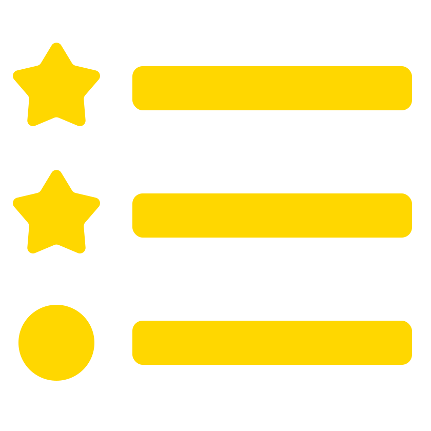
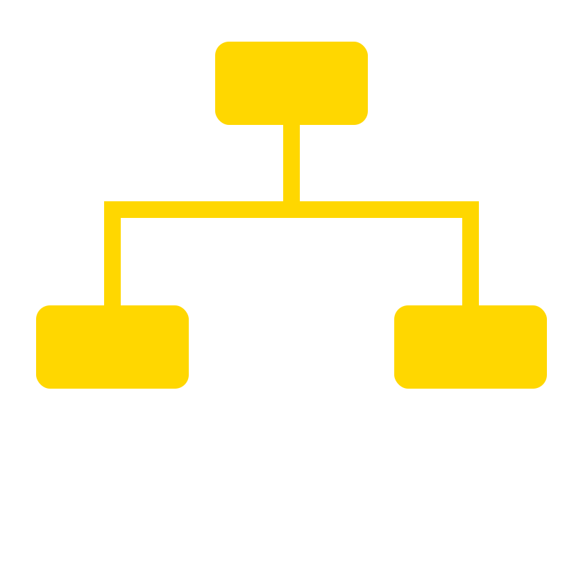

<div align="center">


# UCB Hold

**Reservation System — UCB Mechatronics Lab**

Web platform for managing loans of equipment, accessories, and tools from the **Universidad Católica Boliviana** Mechatronics Lab.

[](https://git.io/typing-svg)

[](https://ucbhold.dev)
[](https://github.com/alejandroramirezvallejos/UCB_Hold/actions/workflows/tests.yml)
[](https://dotnet.microsoft.com/)
[](https://angular.io/)
[](https://www.postgresql.org/)
[](https://redis.io/)
[](https://learn.microsoft.com/en-us/ef/core/)
[](https://www.docker.com/)

</div>

---

<h2>&nbsp;&nbsp;Features</h2>

|                                  |                                                                                                        |
| -------------------------------- | ------------------------------------------------------------------------------------------------------ |
| 📦 **Equipment management**      | Inventory with groups, drawers, and cabinets. IMT code, status, and average cost auto-calculated.      |
| 📋 **Loans with contract**       | End-to-end flow: request → approval → checkout → return. Generates an attached HTML contract.          |
| 📅 **Real-time availability**    | Cart calculates available units per group per day. Only `aprobado` and `activo` loans block capacity.  |
| 🔒 **Conflict prevention**       | Pre-create check + approval-time conflict check prevent double-booking at every transition.             |
| 🔧 **Maintenance**               | Records corrective and preventive maintenance by external company with per-item details.               |
| 🗂️ **Full catalogs**             | Degrees, categories, accessories, components, companies, and cabinets with full CRUD.                  |
| 🛡️ **Validation**                | Password strength (uppercase + number + special char). Carnet, email, NIT, and phone uniqueness.       |
| ♻️ **Logical delete**            | No data is physically deleted. `estado_eliminado = true` with automatic cascade to details.            |
| ⚡ **Optimized queries**         | Single SQL projection with LEFT JOINs across repositories. `AsNoTracking` + composite indexes.         |
| 🧪 **Tested**                    | 90 integration + unit tests with NUnit, FluentAssertions, and EF Core InMemory. CI on every push.      |
| 🐳 **Docker**                    | One-command full-stack deployment via `docker compose up`.                                             |

---

<h2>&nbsp;&nbsp;Stack</h2>

<div align="center">

[](https://skillicons.dev)

</div>

| Layer          | Technology                       | Version     |
| -------------- | -------------------------------- | ----------- |
| Frontend       | Angular                          | 18          |
| Backend        | ASP.NET Core                     | .NET 8      |
| ORM            | Entity Framework Core + Npgsql   | 8.0.10      |
| Database       | PostgreSQL                       | 14+         |
| Cache          | Redis                            | 7           |
| Mapping        | Riok.Mapperly (source-generated) | 3.6.0       |
| Validation     | FluentValidation                 | 11.9.0      |
| Result pattern | Ardalis.Result                   | 10.1.0      |
| Passwords      | BCrypt.Net-Next                  | 4.0.3       |
| Testing        | NUnit + FluentAssertions         | 3.14 / 6.12 |
| CI             | GitHub Actions                   | —           |

---

<h2>&nbsp;&nbsp;Quick Start</h2>

Three ways to run — see [Docs/SETUP.md](Docs/SETUP.md) for full instructions.

**Docker**

```ini
# Code/server.env
ASPNETCORE_ENVIRONMENT=Production
ASPNETCORE_URLS=http://+:80
ConnectionStrings__PostgreSQL=Host=ucb_db;Port=5432;Database=IMT_Reservas;Username=postgres;Password=postgres;Pooling=true;MinPoolSize=2;MaxPoolSize=20
Jwt__Key=<at least 32 chars>
Redis__ConnectionString=ucb_redis:6379
```

```bash
cd Code && docker compose up --build
```

| Service     | URL                   |
| ----------- | --------------------- |
| Frontend    | http://localhost:4200 |
| Backend API | http://localhost:5000 |

**Rider** — Open `Code/`, select `IMT_Reservas.FullStack`, press **Run** (`Shift+F10`). Infrastructure starts automatically.

**Two terminals**

```bash
cd Code && docker compose up -d ucb_db ucb_redis
cd Code/Server && dotnet run    # terminal 1
cd Code/Client && npm start     # terminal 2
```

---

<h2>&nbsp;&nbsp;Tests</h2>

```bash
dotnet test Code/Tests/IMT_Reservas.Tests.csproj
```

Tests run automatically on every push to `main` and `develop` via GitHub Actions. Coverage is uploaded as a browsable HTML artifact.

| Suite                         | Count | Description                                         |
| ----------------------------- | ----- | --------------------------------------------------- |
| `Unit/PrestamoStateTests`     | 17    | State machine transitions and string parsing        |
| `Integration/UsuarioService`  | 13    | User creation, login, validation, soft-delete       |
| `Integration/EquipoService`   | 10    | IMT code assignment, date, group stat recalculation |
| `Integration/PrestamoService` | 12    | Availability checks, status transitions, history   |
| `Integration/CarritoService`  | 8     | Capacity math with concurrent loans                 |

---

<h2>&nbsp;&nbsp;Architecture</h2>

```
┌─────────────────────────────────────────────────────┐
│                    Angular 18                       │
│              (Client - localhost:4200)              │
└──────────────────────┬──────────────────────────────┘
                       │ HTTP /api/*
┌──────────────────────▼──────────────────────────────┐
│              ASP.NET Core 8 — Controllers           │
│         Result<T> · FluentValidation · Mapperly     │
├─────────────────────────────────────────────────────┤
│                    Services                         │
│   Business logic · State machines · Recalculations  │
├─────────────────────────────────────────────────────┤
│                  Repositories                       │
│    EF Core · AsNoTracking · SQL projections         │
├─────────────────────────────────────────────────────┤
│           PostgreSQL 14 — ApplicationDbContext      │
│    Native enums · Composite indexes · Pool 2–20     │
└─────────────────────────────────────────────────────┘
```

---

<h2>&nbsp;&nbsp;Documentation</h2>

| Document                             | Content                                                   |
| ------------------------------------ | --------------------------------------------------------- |
| [Docs/SETUP.md](Docs/SETUP.md)       | Local setup, Docker, user-secrets, 3 run modes            |
| [Docs/API.md](Docs/API.md)           | All endpoints, DTOs, validation rules, and response codes |
| [Docs/DATABASE.md](Docs/DATABASE.md) | ER schema, tables, enums, indexes, business logic         |

---

<h2>&nbsp;&nbsp;Team</h2>

<table>
  <tr>
    <td align="center">
      <a href="https://github.com/josue-balbontin">
        <br/>
        <b>Josue Balbontin</b>
      </a>
    </td>
    <td align="center">
      <a href="https://github.com/alejandroramirezvallejos">
        <br/>
        <b>Alejandro Ramirez</b>
      </a>
    </td>
    <td align="center">
      <a href="https://github.com/FernandoTerrazasLl">
        <br/>
        <b>Fernando Terrazas</b>
      </a>
    </td>
  </tr>
</table>

---

<h2>&nbsp;&nbsp;Contributing</h2>

See [CONTRIBUTING.md](CONTRIBUTING.md) for the workflow, standards, and review expectations.

Please review [CODE_OF_CONDUCT.md](CODE_OF_CONDUCT.md) before contributing.
