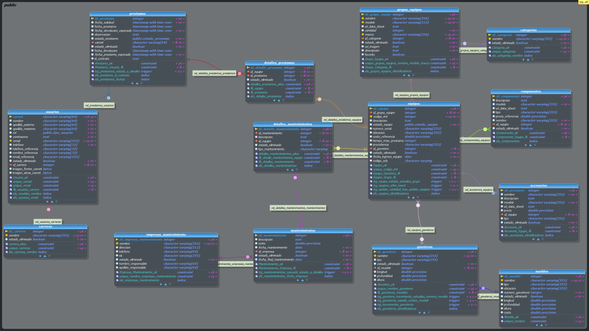

# Base de Datos

PostgreSQL 14+ con Entity Framework Core 8. Schema DDL completo en `DataBase/database.ddl`.

---

## Modelo Entidad–Relación



---

## Tablas

`usuarios`, `prestamos`, `detalles_prestamos`, `categorias`, `carreras`, `empresas_mantenimiento`, `mantenimientos`, `detalles_mantenimientos`, `grupos_equipos`, `equipos`, `gaveteros`, `muebles`, `accesorios`, `componentes`, `contratos`.

Todas incluyen `estado_eliminado BOOLEAN DEFAULT FALSE` para borrado lógico.

---

## Enums

| Enum SQL | Valores |
|----------|---------|
| `estado_prestamo` | pendiente, rechazado, aprobado, activo, finalizado, cancelado |
| `estado_equipo` | operativo, parcialmente_operativo, inoperativo |
| `tipo_usuario` | docente, administrador, estudiante |
| `tipo_mantenimiento` | correctivo, preventivo |

Mapeados en C# vía `[PgName]` y registrados en `Program.cs`.

---

## Triggers

- **`equipos`** — AFTER INSERT/UPDATE/DELETE → recalcula `cantidad_equipos` en `grupos_equipos`
- **`gaveteros`** — AFTER INSERT/UPDATE/DELETE → recalcula `numero_gaveteros` en `muebles`

---

## Vistas

- **`vw_equipos_necesitan_mantenimiento`** — equipos sin mantenimiento en los últimos N meses
- **`vw_ubicaciones_grupos_equipos`** — agrupación de equipos por mueble/gavetero

---

## Índices y justificación

**Usuarios**
Índice sobre `email` y `estado_eliminado` acelera login y validaciones. Índice sobre `nombre`+`estado_eliminado` garantiza listados rápidos sin cargar soft-deleted.

**Prestamos**
Índice compuesto sobre `fecha_prestamo`, `fecha_devolucion_esperada`, `carnet`, `estado_eliminado` optimiza rangos temporales y filtrado por usuario.

**Mantenimientos**
Índice combinado `fecha_inicio`, `fecha_final`, `id_empresa`, `estado_eliminado` segmenta históricos por compañía y período.

**Grupos_equipos**
Índice sobre `categoria`, `nombre`, `modelo`, `marca`, `estado_eliminado` mejora búsquedas combinadas tipo "todas las impresoras HP activas".

**Gaveteros**
Índice `nombre`, `id_mueble`, `estado_eliminado` agiliza asignación y consultas de espacio.

**Equipos**
Índice `id_grupo_equipo`, `codigo_imt`, `estado_eliminado` fundamental para joins y filtros de equipos activos.

**Empresas_mantenimiento**
Índice `nombre`, `estado` acelera selección de proveedores activos.

**Detalles_prestamos**
Índice por `id_prestamo`, `estado_eliminado` optimiza obtención de items de un préstamo.

**Detalles_mantenimientos**
Índice por `id_mantenimiento`, `estado_eliminado` para histórico de intervenciones.

**Componentes**
Índice `nombre`, `id_equipo`, `estado_eliminado` facilita verificación de stock y compatibilidad.

**Categorias / Carreras / Accesorios**
Índices sobre `nombre` + `estado_eliminado` para validación de unicidad y poblado de dropdowns.

---

## Análisis de plan de ejecución

### Consulta pesada sin índices


### Misma consulta con índices


---

## Transacciones y aislamiento

- **Nivel:** `SERIALIZABLE`
- **Justificación:** garantiza ausencia de lecturas no repetibles y lecturas fantasmas

Operaciones críticas (creación de préstamo + contrato + detalles) se ejecutan en una sola transacción vía `SaveChangesAsync` agrupados.

---

## Relación Préstamo ↔ Contrato

`prestamos.id_contrato INTEGER NULL` referencia a `contratos.id` (PK). El contrato se crea opcionalmente al crear el préstamo, en la misma transacción de EF Core. Si el monto del préstamo supera cierto umbral, el frontend envía el HTML del contrato en `PrestamoDto.Contrato`.

```sql
-- Tabla prestamos
id_prestamo                INTEGER PRIMARY KEY
fecha_solicitud            TIMESTAMP
fecha_prestamo             TIMESTAMP
fecha_prestamo_esperada    TIMESTAMP
fecha_devolucion           TIMESTAMP
fecha_devolucion_esperada  TIMESTAMP
observacion                TEXT
estado_prestamo            estado_prestamo
carnet                     TEXT REFERENCES usuarios(carnet)
id_contrato                INTEGER REFERENCES contratos(id)
estado_eliminado           BOOLEAN DEFAULT FALSE
```

```sql
-- Tabla contratos
id                INTEGER PRIMARY KEY
contrato_html     TEXT
estado_eliminado  BOOLEAN DEFAULT FALSE
```

---

## Restauración inicial

```bash
psql -U postgres -c "CREATE DATABASE IMT_Reservas;"
psql -U postgres -d IMT_Reservas -f DataBase/database.ddl
```
